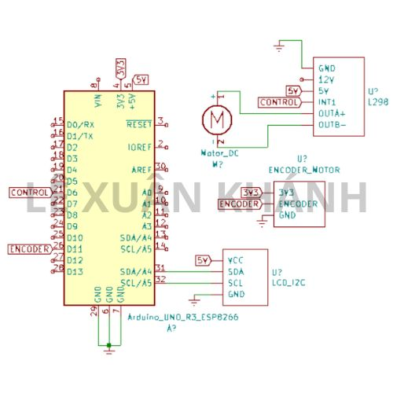
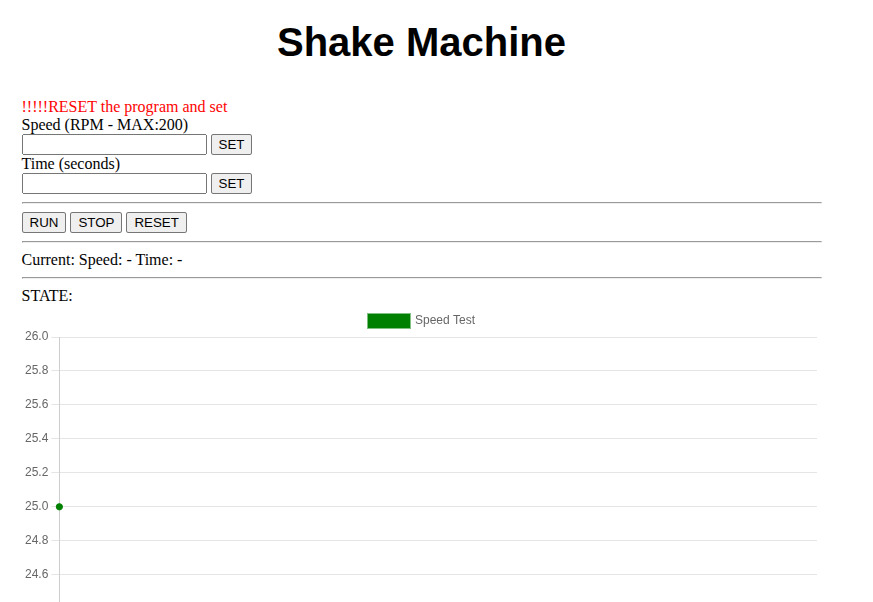

## How to Run This Project

### 1. Hardware
Refer to the schematic below to assemble the hardware.  

---

### 2. Software
This project uses [PlatformIO](https://platformio.org/).  

- Open the project in PlatformIO.  
- Connect your board via USB.  
- Build and upload the firmware.  

---

### 3. Testing
Follow the workflow shown below to verify everything is working.  

📺 Watch the demo video:  

